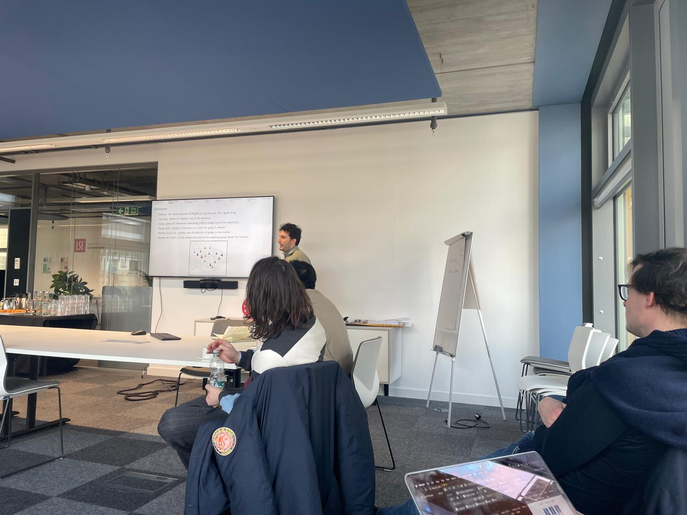
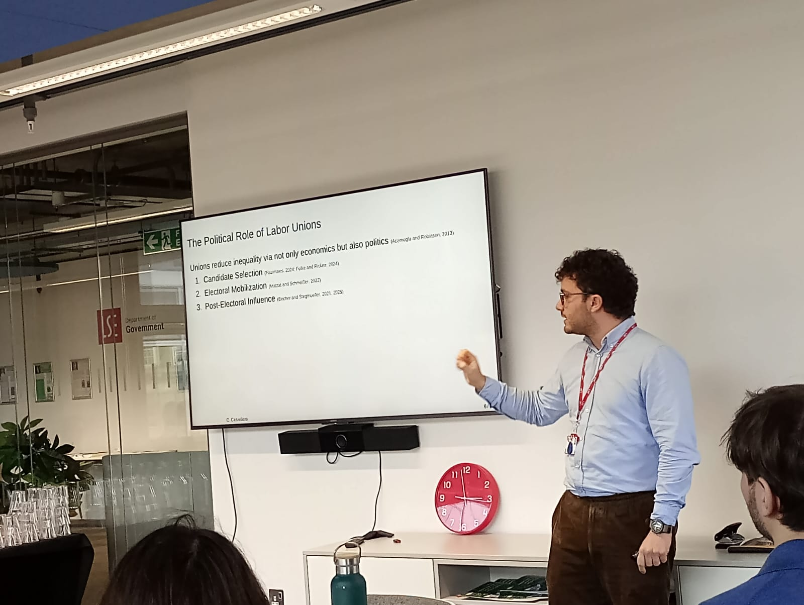
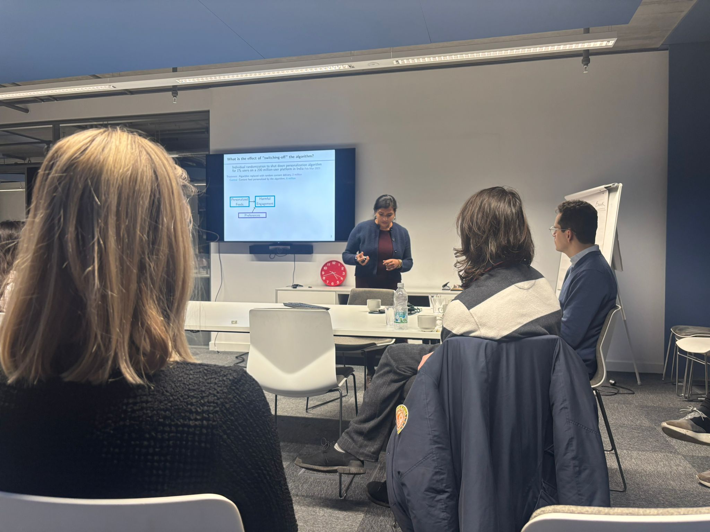

```{=html}
<header class="site-header">
  <div class="wrap">
    <a href="#top" class="brand">PEPS<span>·</span>EC</a>
    <nav class="site-nav">
      <a href="#about">About</a>
      <a href="#themes">Themes</a>
      <a href="#cfp">Call for Papers</a>
      <a href="#dates">Key Dates</a>
      <a href="#venue">Venue</a>
      <a href="#past-edition">Past Edition</a>
      <a href="#organizers">Organizers</a>
      <a href="#contact">Contact</a>
    </nav>
  </div>
</header>

<main id="top">

  <!-- ============ HERO ============ -->
  <section class="hero">
    <div class="wrap">
      <span class="eyebrow on-ink">Second Edition &middot; Early Career Workshop</span>
      <h1>Political Economy &amp; Political Science <em>Early Career Workshop</em></h1>
      <p class="lede">A one-day workshop bringing together early career researchers working across political economy and political science — now jointly hosted by LSE, UCL, and Cambridge.</p>

      <div class="host-row">
        <span class="host-chip">LSE</span>
        <span class="host-chip">UCL</span>
        <span class="host-chip">Cambridge</span>
      </div>

      <div class="hero-meta">
        <div><span>Date</span><strong class="placeholder">[Workshop date — e.g. 12 December 2026]</strong></div>
        <div><span>Venue</span><strong class="placeholder">[Venue — e.g. LSE, Houghton Street, London]</strong></div>
        <div><span>Submission deadline</span><strong class="placeholder">[Deadline — e.g. 3 October 2026]</strong></div>
        <div><span>Format</span><strong>In person</strong></div>
      </div>

      <div class="btn-row">
        <a href="#cfp" class="btn btn-primary">Read the Call for Papers</a>
        <a href="#past-edition" class="btn btn-ghost">See the first edition</a>
        <a href="#contact" class="btn btn-ghost">Contact organizers</a>
      </div>
    </div>
  </section>

  <!-- ============ ABOUT ============ -->
  <section id="about">
    <div class="wrap two-col">
      <div>
        <span class="eyebrow">About the workshop</span>
        <h2>A venue for work in progress</h2>
      </div>
      <div>
        <p class="about-lead">The workshop gives PhD candidates and early career researchers a focused, low-stakes setting to present ongoing work and receive detailed feedback.</p>
        <p class="body-text">Launched at LSE in January 2026, the workshop returns for a second edition — now organized jointly with UCL and Cambridge. Each paper is paired with a discussant from a different institution, encouraging cross-institutional feedback and building a wider network among early career political economy and political science researchers.</p>
        <p class="body-text placeholder" style="margin-top:16px;">[Placeholder: note who the workshop is for — e.g. PhD students and postdocs within a certain number of years of their viva/defense, across LSE, UCL, Cambridge, and other UK institutions.]</p>
      </div>
    </div>
  </section>

  <!-- ============ THEMES ============ -->
  <section id="themes" class="section-tight">
    <div class="wrap">
      <span class="eyebrow">Scope</span>
      <h2>Topics we welcome</h2>
      <p class="body-text">The workshop welcomes theoretical, empirical, and methodological contributions. Suggested themes below — edit freely to match this year's focus.</p>

      <div class="theme-grid">
        <div class="theme-card">
          <span class="num">01</span>
          <h3>Political behavior</h3>
          <p>Public opinion, voting behavior, and the drivers of political attitudes.</p>
        </div>
        <div class="theme-card">
          <span class="num">02</span>
          <h3>Governance &amp; accountability</h3>
          <p>Institutions, corruption, transparency, and state capacity.</p>
        </div>
        <div class="theme-card">
          <span class="num">03</span>
          <h3>Comparative political economy</h3>
          <p>Redistribution, inequality, and the politics of economic policy.</p>
        </div>
        <div class="theme-card">
          <span class="num">04</span>
          <h3>Development &amp; conflict</h3>
          <p>Political and economic development, state-building, and conflict.</p>
        </div>
        <div class="theme-card">
          <span class="num">05</span>
          <h3>Experimental &amp; causal methods</h3>
          <p>Field, survey, and lab experiments; identification strategies.</p>
        </div>
        <div class="theme-card">
          <span class="num">06</span>
          <h3>Political institutions</h3>
          <p>Legislatures, electoral systems, and the design of democratic institutions.</p>
        </div>
      </div>
    </div>
  </section>

  <!-- ============ CALL FOR PAPERS ============ -->
  <section id="cfp" class="cfp">
    <div class="wrap">
      <span class="eyebrow on-ink">Call for Papers</span>
      <h2>Submit your work</h2>
      <p class="body-text placeholder">[Placeholder: one or two sentences on what kind of papers you're looking for — completed papers, works in progress, pre-registrations, or extended abstracts.]</p>

      <div class="cfp-grid">
        <ul class="cfp-list">
          <li><span class="mark">01</span> Submit an extended abstract (500–1000 words) or a full draft paper.</li>
          <li><span class="mark">02</span> Open to PhD candidates and researchers within <span class="placeholder">[X years]</span> of completing their PhD.</li>
          <li><span class="mark">03</span> A limited number of travel bursaries are available — see submission form.</li>
          <li><span class="mark">04</span> Each accepted paper is assigned a discussant and allocated <span class="placeholder">[e.g. 45 minutes]</span> for presentation and discussion.</li>
        </ul>

        <div class="cfp-card">
          <h3>How to submit</h3>
          <ul>
            <li>Anonymized PDF (no author names in file or metadata)</li>
            <li>Cover email with author(s), affiliation, and abstract</li>
            <li>One submission per author as lead presenter</li>
          </ul>
          <a href="#contact" class="btn btn-primary" style="width:100%; justify-content:center;">Submit a paper</a>
        </div>
      </div>
    </div>
  </section>

  <!-- ============ KEY DATES (signature ledger element) ============ -->
  <section id="dates">
    <div class="wrap">
      <span class="eyebrow">Timeline</span>
      <h2>Key dates</h2>
      <p class="body-text">Mark your calendar — dates below are placeholders until confirmed.</p>

      <div class="ruler">
        <div class="ruler-line"></div>
        <div class="ruler-track">
          <div class="ruler-item">
            <span class="date placeholder">[1 Sep 2026]</span>
            <h4>Call opens</h4>
            <p>Submission portal opens for abstracts and papers.</p>
          </div>
          <div class="ruler-item">
            <span class="date placeholder">[3 Oct 2026]</span>
            <h4>Submission deadline</h4>
            <p>Deadline for abstract or paper submissions.</p>
          </div>
          <div class="ruler-item">
            <span class="date placeholder">[31 Oct 2026]</span>
            <h4>Notifications sent</h4>
            <p>Authors notified of acceptance decisions.</p>
          </div>
          <div class="ruler-item">
            <span class="date placeholder">[12 Dec 2026]</span>
            <h4>Workshop day</h4>
            <p>Full-day program with presentations and discussion.</p>
          </div>
        </div>
      </div>
    </div>
  </section>

  <!-- ============ VENUE ============ -->
  <section id="venue" class="section-tight">
    <div class="wrap">
      <span class="eyebrow">Location</span>
      <h2>Venue</h2>
      <div class="venue-box">
        <div>
          <h3 class="placeholder">[Venue name, e.g. LSE — 32 Lincoln's Inn Fields]</h3>
          <p class="placeholder">[Full address]</p>
          <p class="placeholder">[Nearest stations / travel notes]</p>
        </div>
        <div>
          <h3>Getting there</h3>
          <p class="placeholder">[Placeholder: transport notes, accessibility information, and a link to a map once the venue is confirmed.]</p>
        </div>
      </div>
    </div>
  </section>

  <!-- ============ PAST EDITION ============ -->
  <section id="past-edition" class="section-tight">
    <div class="wrap">
      <span class="eyebrow">First Edition</span>
      <h2>Friday 30 January — LSE</h2>
      <p class="body-text">The inaugural workshop was held at LSE's Centre Building. Eight early career researchers from Oxford, LSE, UCL, and King's College London presented work in progress across four sessions, each paired with a discussant from another institution.</p>

      <div class="edition-banner" style="margin-top:32px;">
        <div>
          <h3>LSE – Political Economy and Political Science Early Career Workshop</h3>
          <p>Friday 30 January, 12:45 – 18:10 · LSE, Centre Building, Room CBG.4.17</p>
        </div>
        <a href="images/first-edition-programme.pdf" class="btn btn-primary" target="_blank" rel="noopener">Download the full programme</a>
      </div>

      <ul class="programme-list">
        <li>
          <span class="slot">13:00 – 14:30</span>
          <div class="talk">
            <h4>Pilar Sanchez Bellosta <span style="font-weight:400; color:var(--slate);">(University of Oxford)</span></h4>
            <p>"When Girls Are Taken: Political Consequences of Conflict-Related Sexual Violence and Abductions in Nigeria"</p>
            <span class="discussant">Discussant: Sarah Brierley (LSE)</span>
          </div>
        </li>
        <li>
          <span class="slot"></span>
          <div class="talk">
            <h4>Davide Zufacchi <span style="font-weight:400; color:var(--slate);">(University College London)</span></h4>
            <p>"Competition and Violence in Illegal Markets: Theory and Evidence from Naples"</p>
            <span class="discussant">Discussant: Tak-Huen Chau (LSE)</span>
          </div>
        </li>
        <li>
          <span class="slot">14:50 – 16:20</span>
          <div class="talk">
            <h4>Christian Cerverella <span style="font-weight:400; color:var(--slate);">(LSE)</span></h4>
            <p>"Isn't Labour Working? De-Unionization and Working-Class Representation in Post-Industrial Britain"</p>
            <span class="discussant">Discussant: Carlos Felipe Balcazar (UCL)</span>
          </div>
        </li>
        <li>
          <span class="slot"></span>
          <div class="talk">
            <h4>Carlos Felipe Balcazar <span style="font-weight:400; color:var(--slate);">(University College London)</span></h4>
            <p>"Collective Action from Labor in the Age of AI: Theory and Evidence from the Advent of ChatGPT"</p>
            <span class="discussant">Discussant: Sichen Li (LSE)</span>
          </div>
        </li>
        <li>
          <span class="slot">16:40 – 18:10</span>
          <div class="talk">
            <h4>Aarushi Karla <span style="font-weight:400; color:var(--slate);">(University of Oxford)</span></h4>
            <p>"Hate in the Time of Algorithms: Evidence on Online Behavior from a Large-Scale Experiment"</p>
            <span class="discussant">Discussant: Pavithra Suryanarayan (LSE)</span>
          </div>
        </li>
        <li>
          <span class="slot"></span>
          <div class="talk">
            <h4>Irene Germani <span style="font-weight:400; color:var(--slate);">(King's College London)</span></h4>
            <p>"Keeping Mum About Debt: The Impact of Party Cues on Public Fiscal Preferences"</p>
            <span class="discussant">Discussant: Joachim Wehner (LSE)</span>
          </div>
        </li>
      </ul>

      <div class="gallery-grid">
        
        
        
      </div>
    </div>
  </section>

  <!-- ============ ORGANIZERS ============ -->
  <section id="organizers">
    <div class="wrap">
      <span class="eyebrow">Committee</span>
      <h2>Organizers</h2>
      <p class="body-text">The second edition's committee is growing to reflect its three host institutions — three more organizers from UCL and Cambridge are joining soon.</p>
      <div class="card-grid">
        <div class="person-card">
          
          <h4>Marta Antonetti</h4>
          <p class="placeholder">[Institution, department]</p>
        </div>
        <div class="person-card">
          
          <h4>Elise Antoine</h4>
          <p class="placeholder">[Institution, department]</p>
        </div>
        <div class="person-card">
          
          <h4>Luis Cornago-Bonal</h4>
          <p class="placeholder">[Institution, department]</p>
        </div>
        <div class="person-card">
          
          <h4>Kun Heo</h4>
          <p class="placeholder">[Institution, department]</p>
        </div>
        <div class="person-card">
          
          <h4>Leo Falabella</h4>
          <p class="placeholder">[Institution, department]</p>
        </div>
        <div class="person-card">
          <div class="avatar">F</div>
          <h4>Felipe Torres-Raposo</h4>
          <p>LSE</p>
        </div>
        <div class="person-card">
          <div class="avatar">?</div>
          <h4 class="placeholder">[Name]</h4>
          <p class="placeholder">[UCL — Institution, department]</p>
        </div>
        <div class="person-card">
          <div class="avatar">?</div>
          <h4 class="placeholder">[Name]</h4>
          <p class="placeholder">[Cambridge — Institution, department]</p>
        </div>
        <div class="person-card">
          <div class="avatar">?</div>
          <h4 class="placeholder">[Name]</h4>
          <p class="placeholder">[Institution, department]</p>
        </div>
      </div>
    </div>
  </section>

</main>

<footer id="contact">
  <div class="wrap">
    <div class="footer-grid">
      <div>
        <span class="brand">PEPS·EC</span>
        <p>Political Economy &amp; Political Science Early Career Workshop. An annual gathering for early career researchers, jointly hosted by LSE, UCL, and Cambridge.</p>
      </div>
      <div>
        <h5>Contact</h5>
        <ul>
          <li><a href="mailto:placeholder@example.ac.uk" class="placeholder">[organizers@email.ac.uk]</a></li>
          <li><a href="#" class="placeholder">[Twitter / X handle]</a></li>
        </ul>
      </div>
      <div>
        <h5>Links</h5>
        <ul>
          <li><a href="#cfp">Call for Papers</a></li>
          <li><a href="#dates">Key dates</a></li>
          <li><a href="#past-edition">Past edition</a></li>
        </ul>
      </div>
    </div>
    <div class="footer-bottom">
      <span>© <span class="placeholder">[2026]</span> PEPS·EC</span>
      <span>Built for GitHub Pages</span>
    </div>
  </div>
</footer>
```
